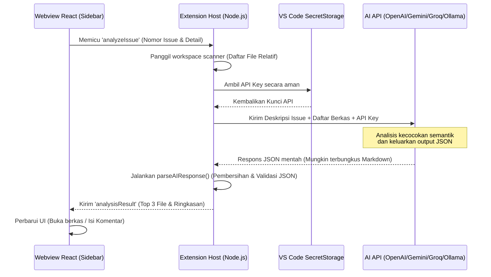

# IssueMapper AI — VS Code Extension

[](https://code.visualstudio.com/)
[](https://opensource.org/licenses/MIT)
[](https://www.typescriptlang.org/)
[](https://react.dev/)

**IssueMapper AI** adalah ekstensi Visual Studio Code (VS Code) yang dirancang khusus untuk mempermudah alur kerja pemelihara (*maintainers*) proyek sumber terbuka (*open source*). Ekstensi ini menjembatani jurang antara platform GitHub dan editor lokal Anda dengan memetakan deskripsi issue GitHub secara otomatis ke file kode terkait di dalam workspace menggunakan kecerdasan buatan (AI).

---

## 📖 Ringkasan Proyek (Overview)

Saat mengelola proyek perangkat lunak, pemelihara sering kali menghabiskan banyak waktu hanya untuk melakukan triase masalah:
1. Membaca laporan bug/masalah dari pengguna di web GitHub.
2. Membuka IDE lokal dan mencari file mana yang kemungkinan besar bertanggung jawab atas bug tersebut.
3. Menulis komentar respons awal secara manual.

**IssueMapper AI** menyelesaikan masalah ini dengan menghadirkan antarmuka sidebar interaktif di VS Code. Ekstensi ini mengambil issue GitHub yang aktif, menganalisis repositori lokal Anda secara efisien, mengidentifikasi lokasi kode penyebab masalah dengan AI, memandu navigasi *one-click* langsung ke file tersebut, dan menghasilkan draf jawaban balasan instan.

---

## ✨ Fitur Utama (Key Features)

### 1. Navigasi Cepat & Triase Berbasis AI
* **Two-Stage Context Retrieval**:
  * **Tahap 1 (Pemetaan Berkas)**: Memindai seluruh path relatif workspace proyek (menyaring folder seperti `node_modules/`, `.git/`, dll. hingga batas maksimal 1000 file) untuk dikirim ke LLM. LLM menganalisis kecocokan semantik antara teks issue dengan nama berkas/struktur folder, lalu merekomendasikan Top 3 berkas terkait beserta tingkat keyakinannya (`HIGH`/`MEDIUM`/`LOW`) dan alasannya.
  * **Tahap 2 (Draf Jawaban Terkonteks)**: Mengambil potongan kode dari dokumen aktif yang sedang Anda edit (`vscode.window.activeTextEditor`) sebagai konteks instan bagi AI untuk merumuskan draf komentar tanggapan yang akurat.

### 2. Antarmuka Pengguna Terintegrasi (React Webview)
* UI sidebar interaktif yang dibangun menggunakan React 19 + Vite yang di-*bundle* menjadi berkas tunggal tanpa pemisahan kode (*zero code-splitting*).
* Menyesuaikan tema warna (*color tokens*) native VS Code secara dinamis (mendukung Dark/Light/High Contrast theme) agar terlihat menyatu dengan editor.
* Filter label GitHub, kolom pencarian teks instan, navigasi satu klik ke berkas kode lokal, pengiriman komentar, serta penutupan issue langsung dari sidebar.

### 3. Keamanan Tingkat Host (Secure API Storage)
* Seluruh kredensial sensitif seperti Kunci API (OpenAI, Gemini, Groq) disimpan secara terenkripsi menggunakan **VS Code SecretStorage API** (terintegrasi dengan hardware keychain OS Anda seperti Windows Credential Manager / macOS Keychain).
* Kunci API diproses murni di sisi **Extension Host** (backend lokal ekstensi) dan tidak pernah dikirim ke webview React, menjamin keamanan tingkat tinggi dari serangan injeksi pihak ketiga.

### 4. Multi-Provider AI Engine dengan Fallback Dinamis
Ekstensi ini mendukung integrasi dengan berbagai penyedia AI terkemuka secara fleksibel:
* **OpenAI Adapter**: Menggunakan model `gpt-4o` dengan fallback otomatis ke `gpt-4o-mini` saat API sibuk.
* **Google Gemini Adapter**: Rantai fallback berlapis: `gemini-3-flash` $\rightarrow$ `gemini-2.5-flash` $\rightarrow$ `gemini-3.1-flash-lite` $\rightarrow$ `gemini-2.5-flash-lite`.
* **Groq Cloud Adapter**: Integrasi cepat model open source: `deepseek-r1-distill-llama-70b` $\rightarrow$ `llama-4-scout-17b-16e-instruct` $\rightarrow$ `mixtral-8x7b-32768` $\rightarrow$ `llama3-8b-8192`.
* **Ollama Adapter**: Dukungan penuh untuk model LLM lokal yang berjalan di localhost (misalnya model kustom `llama3`).
* **Resiliensi Tangguh**: Dilengkapi deteksi otomatis HTTP status `429` (Rate Limit) dan `5xx` (Server Overload) untuk memicu fallback model secara otomatis sebelum mengirim error ke UI.
* **Robust JSON Parser**: Algoritma parser tangguh yang mampu membersihkan tanda kurung kode markdown (```json ... ```) dari LLM, mendeteksi struktur JSON dengan regex `{}` jika parsing utama gagal, dan memvalidasi tipe data output.

---

## 🛠️ Arsitektur Sistem

Alur interaksi dan komunikasi data antara Webview React, Extension Host (VS Code), dan AI Provider dapat digambarkan sebagai berikut:



---

## 📂 Struktur Direktori Utama

Ekstensi ini terbagi menjadi dua bagian besar: **Host Extension** (TypeScript/Node.js) dan **Webview Frontend** (Vite + React + TypeScript).

```text
├── .vscode/                 # Konfigurasi workspace & tugas debugging
├── out/                     # Hasil kompilasi akhir kode Host (CommonJS)
├── src/                     # Kode Sumber Host Extension
│   ├── ai/
│   │   └── AIClient.ts      # Definisikan IAIProvider, OpenAI/Gemini/Groq/Ollama Adapters & parseAIResponse
│   ├── providers/
│   │   └── SidebarProvider.ts  # Handler utama view sidebar, listener IPC (analyzeIssue, openFile, quickSuggest)
│   ├── utils/
│   │   ├── github.ts        # Dynamic loader Octokit GraphQL/REST client untuk sinkronisasi issues
│   │   ├── storageManager.ts# Pengelolaan kredensial (SecretStorage) & state (globalState/workspaceState)
│   │   └── workspaceScanner.ts # Pemindai berkas workspace asinkron dengan pola pengecualian
│   └── extension.ts         # Titik masuk utama (Entry Point) aktivasi ekstensi VS Code
├── tsconfig.json            # Konfigurasi TypeScript compiler dengan pemuatan tipe global node & mocha
├── webview/                 # Kode Sumber UI Sidebar (React App)
│   ├── dist/                # Hasil build produksi bundle tunggal (bundle.js, bundle.css)
│   ├── src/
│   │   ├── App.tsx          # Komponen UI utama, parser markdown ringan, form komentar & komunikasi IPC
│   │   └── index.css        # Desain CSS tema native VS Code
│   ├── vite.config.ts       # Pengaturan bundler Vite untuk menghasilkan output single-file
│   └── package.json
└── package.json             # Manifest ekstensi, kontribusi view, command, dependensi & script build
```

---

## ⚡ Cara Menjalankan & Mengembangkan Proyek

### Prasyarat
* Instalasi **Node.js** (LTS v18 atau v20+)
* Instalasi **Git CLI**
* **VS Code** terinstal di komputer Anda

### Langkah Instalasi
1. Klon repositori ini ke komputer lokal Anda.
2. Buka direktori root proyek menggunakan VS Code.
3. Jalankan perintah instalasi dependensi di terminal:
   ```bash
   # Install dependensi untuk Host Extension
   npm install
   
   # Install dependensi untuk Webview Frontend
   cd webview
   npm install
   cd ..
   ```

### Langkah Kompilasi & Build
Gunakan skrip yang telah disediakan di root [package.json](file:///C:/Koding/issue_mapper/package.json) untuk melakukan proses *build*:
```bash
# Kompilasi TypeScript host sekaligus mem-build webview menjadi bundle tunggal
npm run build:all
```

Skrip ini akan mengeksekusi dua proses:
1. `tsc -p ./` untuk mengompilasi kode TypeScript host ke folder `out/`.
2. `cd webview && npm run build` untuk mengemas React Webview ke dalam `webview/dist/bundle.js`.

### Menjalankan Sesi Debugging (F5)
1. Buka berkas [src/extension.ts](file:///C:/Koding/issue_mapper/src/extension.ts) atau file typescript lainnya.
2. Tekan tombol **F5** pada keyboard Anda (atau masuk ke menu *Run and Debug* di VS Code dan klik *Launch Extension*).
3. VS Code baru (jendela *Extension Development Host*) akan terbuka secara otomatis dengan membawa ekstensi **IssueMapper AI** aktif di dalamnya.
4. Klik ikon **Issues** (ikon berbentuk lingkaran peringatan di Activity Bar kiri) untuk membuka panel sidebar.

---

## 🔒 Panduan Konfigurasi Kunci API

Saat pertama kali dibuka, ekstensi akan mendeteksi repositori lokal Anda dan melakukan otentikasi GitHub secara native. Untuk mengaktifkan analisis AI, Anda dapat mengonfigurasi kunci API secara aman:

1. Klik tombol roda gigi **Pengaturan** (Settings) di sudut kanan atas panel ekstensi.
2. Pilih penyedia AI yang ingin Anda gunakan:
   * **OpenAI**: Masukkan Kunci API OpenAI (`sk-...`). Model default: `gpt-4o-mini`.
   * **Google Gemini**: Masukkan Kunci API Gemini Anda. Model default: `gemini-3-flash`.
   * **Groq**: Masukkan Kunci API Groq Cloud Anda. Model default: `deepseek-r1-distill-llama-70b`.
   * **Ollama**: Tentukan Host URL lokal Anda (misalnya: `http://localhost:11434`) dan nama model lokal yang digunakan (misalnya: `llama3`).
3. Klik **Save Settings**. Kunci API akan langsung disimpan ke dalam OS Secure Keychain Anda melalui VS Code `SecretStorage`.

---

## 📜 Lisensi
Proyek ini didistribusikan di bawah lisensi **MIT**. Silakan lihat berkas `LICENSE` untuk informasi selengkapnya.